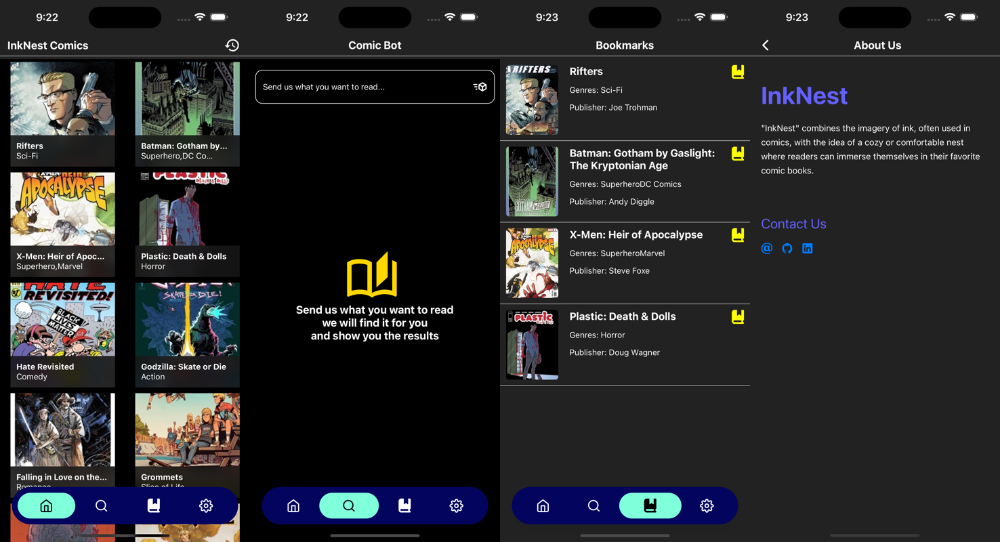

  

  
<h1 align="center">
  InkNest
</h1>

  "InkNest" combines the imagery of ink, often used in comics, with the idea of a cozy or comfortable nest where readers can immerse themselves in their favorite comic books.

  
  
  
  

  

## Download
Get the app from our [releases page](https://github.com/p2devs/InkNest/releases).
