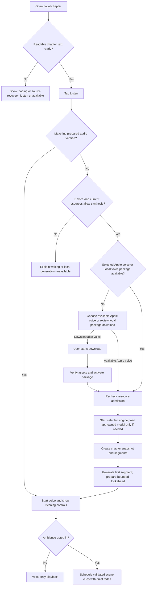
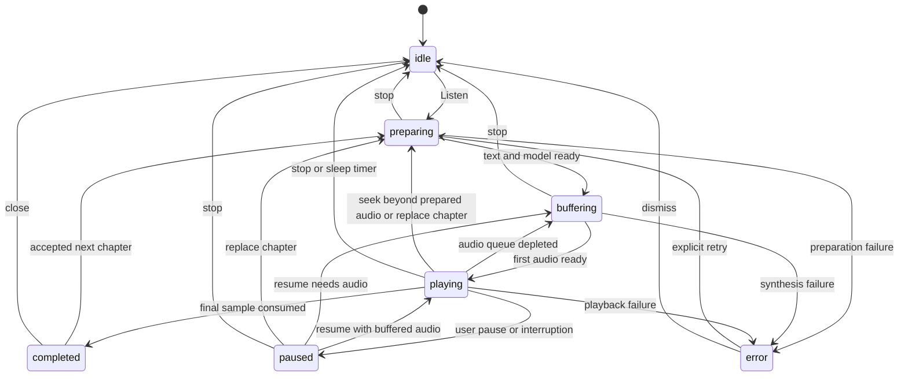
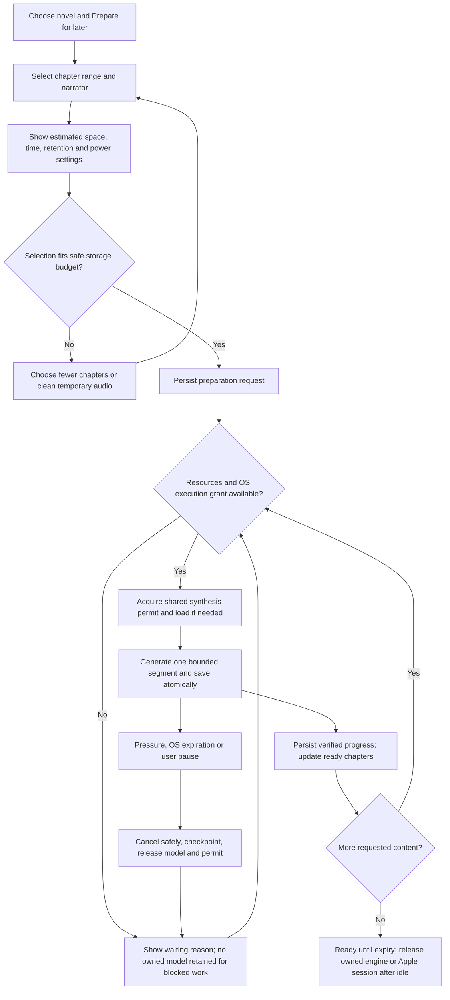

# Novel narration flows

These flows describe the local model experience in [plan.md](plan.md), including the required resource protection and prepare-for-later queue. Optional cloud/generated-ambience alternatives remain unselected.

Implementation checkpoint: the current default-off iOS preview supports foreground segment preparation/playback and optional scene-tag inspection. It pauses on backgrounding. The queue, native background preparation and ambience flows below are still target behavior; see [handover.md](handover.md).

## First listen

On iOS, prefer an auditioned available Apple system voice that passes preparation/background checks. No downloadable neural package is required for that path. If unavailable or inadequate, explain and offer the downloadable local voice; never silently replace an active narrator. Unsupported local generation retains text reading and compatible prepared playback. A failed download retains existing usable packages and offers retry.

When ambience is enabled, independently check Apple Intelligence availability and language support. Use bounded Foundation Models scene analysis when available and resource-admitted, otherwise rules/manual cues/silence. Apple Intelligence being disabled does not imply Apple speech voices are unavailable. Analysis failure never interrupts narration; Apple model residency stays OS-managed.

## Everyday controls

| Action | Proposed behavior |
| --- | --- |
| Pause/resume | Preserve current audible position and pause/resume both audio layers |
| Stop | Cancel synthesis, clear scheduled playback, release focus, save bookmark, fade/stop ambience |
| Start from paragraph | Invalidate old pending work; begin at that paragraph's first segment |
| Change speed | Apply a pitch-preserving playback rate if validated; reschedule cue times using source audio position |
| Change narrator | Cancel pending work; regenerate from the current segment boundary; label the small replay explicitly |
| Manual scroll | Keep audio position; turn follow-along off until the user chooses to follow again |
| Leave reader | Keep the active session; provide a compact route back to the playing chapter |
| Start another chapter | Replace the active session, cancel stale work, and update media metadata atomically |
| Sleep timer expires | Stop voice and ambience through the playback owner, including while backgrounded |
| End of chapter | Mark listening complete after the final sample; stop unless auto-advance was explicitly enabled |
| Prepare another novel | Enqueue a selected range after showing resource estimates; current listening has priority |
| Pause/cancel preparation | Persist progress or cancel future work; offer deletion of partial audio; playback is independent |
| Delete generated audio | Remove temporary narration only; stop/release affected active playback before deleting |

Paragraph highlighting is segment-level initially. Word-by-word highlighting needs timing/alignment evidence and is deferred.

## Playback state model

Model download/load has a separate lifecycle in system design. Buffering pauses ambience. Retry creates a new work generation; completed or cancelled old events are ignored. A pause during preparation records user intent so generation completion cannot auto-play.

## Offline and background

1. Open saved chapter text or a prepared chapter. If neither exists, explain that the chapter must first be downloaded; having a voice package does not provide story content.
2. If prepared audio matches the chapter/voice revision, play it immediately. Otherwise synthesize locally from saved text when the model is available.
3. Offer **Prepare for later** for the current chapter or another novel's selected range. Show readiness only while every required temporary audio file and its timing metadata are verified and present. Display expiry; prepared audio is not permanent.
4. On screen lock, native playback continues with prepared audio. Continued synthesis is a separate tested capability; if the queue runs out, pause clearly and resume when work can run again.
5. After process death or explicit app termination, never claim uninterrupted playback. On next launch, restore the bookmark and wait for the user to resume. Replay at most the unfinished segment when precise seeking is unavailable.

## Prepare another novel for later

The waiting loop represents resource/OS events, not continuous polling. A user-paused job waits for explicit resume. Failure/cancel are separate outcomes; cancellation never returns to waiting automatically. Current listening may preempt future generation at a segment boundary.

Queue cards show **Queued**, **Preparing 3 of 8 chapters**, **3 chapters ready**, **Waiting for charging**, **Cooling down**, **Waiting for space**, **Waiting for system**, **Paused**, **Ready until [date]**, or **Needs preparation** after removal/expiry. Provide Play ready chapters, pause/resume, cancel, reorder, and Delete audio. Show an estimated completion time only while generation is active and measured throughput is meaningful.

When a model has no admitted work, it is released after the idle policy; blocked queues do not keep it resident. Resource events or loss of a background grant trigger earlier release. Playing an already prepared chapter reads files without loading the model. Automatic audio cleanup preserves the listening bookmark, so regeneration can restart from a known passage.

## Smooth operation under pressure

| Condition | Experience |
| --- | --- |
| Phone cannot safely load the voice | Explain local-generation unavailability; keep normal reading and compatible prepared playback available |
| Device can generate safely but too slowly for live audio | Offer prepare-first mode |
| Phone warms or power is low | Pause future preparation with a reason; preserve completed audio; severe conditions also stop generation for live listening |
| User resumes scrolling or playback needs its next chunk | Background preparation yields; the app remains responsive |
| Storage fills or audio expires | Reclaim eligible temporary files; show exactly which chapters need preparation again |
| OS postpones/stops background work | Keep the checkpoint and wait; offer foreground preparation without promising a finish time |

## Scene ambience example

This is an illustration of proposed behavior, not an extracted real chapter.

| Passage | Cue |
| --- | --- |
| The traveller shelters beside a forest stream | Quiet forest/water ambience after a confident setting match |
| They enter a quiet study and begin a conversation | Fade the outdoor loop out; silence or an approved indoor loop |
| “I remember the rain,” she says, beside the fireplace | Keep the current setting; the quoted memory is not a rain cue |
| A difficult-to-classify dream or metaphor | Silence |

## Recovery rules

| Failure | Reader-facing outcome |
| --- | --- |
| Text unavailable or challenge page | Reading/source recovery; no narration of the error page |
| Model unavailable while offline | Use matching prepared audio if present; otherwise show required download |
| Changed chapter text or translation | Offer restart at a safe passage; discard mismatched playback position |
| Corrupted audio segment | Regenerate if possible; otherwise pause with retry; do not skip story text silently |
| Audio focus lost/headphones unplugged | Pause both layers; resume only under the agreed platform/user policy |
| Missing/invalid ambience asset | Continue voice-only |
| Low storage or memory pressure | Stop speculative preparation, preserve active work where possible, and offer cleanup/retry |
| Next chapter unavailable | Finish current chapter and stop with an explanation |
| OS cache purge or audio expiry | Keep story text/bookmarks, mark missing chapters Needs preparation, and offer regeneration |
| Duplicate background callback or foreground reopen | Attach to the single work owner; do not load another model or repeat a completed segment |
