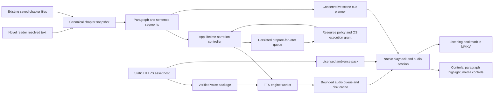

# Novel narration system design

Status: target architecture, researched 2026-10-05. A gated iOS foreground preview now implements part of this design; see [handover.md](handover.md) for its exact scope and validation. Production voice acceptance, full native builds and physical-device benchmarks remain open.

## Architecture

Use one local narration feature with a narrow engine boundary. The source layer supplies text; the session owner coordinates generation and native playback; the UI observes it. Do not add a server for the proposed local path.

The static host distributes immutable model and optional sound assets. Chapter text stays on the device in this design. Hosting ownership, URLs, bandwidth budget, and update policy are unresolved; the existing notification API is not a model-inference service.

## Candidate technology and evidence

### Voice model and runtime

| Candidate | Why evaluate it | Decision gate |
| --- | --- | --- |
| Apple system speech through AVSpeechSynthesizer | Native iOS narration candidate with installed voices; no app-owned Kokoro package required for this path | Voice audition, language/voice availability, generated buffer/file output, cancellation and native background-task validation |
| Kokoro with React Native ExecuTorch | A documented React Native TTS pipeline and imperative API reduce integration work | Exact release/native build, voice audition, memory/latency, platform floor and artifact licensing |
| Kokoro with sherpa-onnx | Native offline TTS alternative with Android/iOS support | Select and audit a maintained RN wrapper or justify a narrow native bridge; verify voices and languages in the exact exported package |
| Smaller supported local model | Possible alternative if Kokoro misses device budgets | Re-run the same voice-quality and lifecycle gates; smaller is not automatically acceptable |
| Hosted TTS | Alternative if the user prioritizes voice quality over local inference | Resolve D1/D7, operating budget, text-processing terms, network/offline behavior, and backend ownership |

Kokoro's upstream model card describes an 82M-parameter model under Apache-2.0. That does not establish the license of every converted artifact, voice, phonemizer, or audio asset used in an app. Pin each artifact and inspect its accompanying license. [Upstream model card](https://huggingface.co/hexgrad/Kokoro-82M)

React Native ExecuTorch's current 0.10 TTS documentation describes Kokoro language packages of approximately 332 MB, 24 kHz output, sentence-by-sentence chunks, cancellation, and an imperative pipeline. These are upstream capabilities, not measurements in InkNest; total installed bytes and runtime RAM must be measured separately. Package-specific language coverage must be verified. [TTS documentation](https://docs.swmansion.com/react-native-executorch/docs/extensions/text-to-speech)

The current exported model card lists FP32 variants with different backend sizes and a 1–128-token input range; phonemizers, lexicons, and voice embeddings are additional assets. Pin the export together with its compatible runtime. Do not substitute upstream model limits for those of the selected mobile export. [Export model card](https://huggingface.co/software-mansion/react-native-executorch-kokoro)

Its setup documentation requires New Architecture and compatible worklets, but currently describes the Android floor inconsistently: “Android 13+” alongside minSdk 26. InkNest declares minSdk 24, so this is a selection blocker until pinned native source and real builds resolve it. Static-framework linking also needs verification against the current Firebase Pod configuration. [Setup requirements](https://docs.swmansion.com/react-native-executorch/docs/fundamentals/getting-started)

The published compatibility table lists RN 0.84 support; this establishes a candidate worth testing, not a successful InkNest build. Use documentation matching the pinned release rather than mixing current and `/next` APIs. [Compatibility table](https://docs.swmansion.com/react-native-executorch/docs/other/compatibility)

sherpa-onnx supplies offline speech tooling and mobile targets. Its exact Kokoro exports and the chosen RN wrapper need separate validation; native Android/iOS support is not proof that a particular wrapper works with RN 0.84.1. [Upstream repository](https://github.com/k2-fsa/sherpa-onnx), [Kokoro exports](https://k2-fsa.github.io/sherpa/onnx/tts/pretrained_models/kokoro.html)

Evaluate an existing wrapper before writing native glue. `react-native-sherpa-onnx` documents a TurboModule and mobile TTS; its exact release and transitive dependencies still need app-level testing. [Wrapper repository](https://github.com/XDcobra/react-native-sherpa-onnx)

Recommendation: evaluate installed Apple speech voices first on iOS, with Kokoro as the downloadable local candidate and sherpa-onnx as an alternative runtime for that candidate. Select one speech engine per session, with at most one downloaded inference runtime. Foundation Models scene analysis is a separate capability, not another speech engine.

### Apple capability selection

The user prefers Apple Intelligence when available. Implement two independent capability checks: **scene analysis** using the on-device Foundation Models `SystemLanguageModel`, and **narration** using public AVSpeechSynthesizer APIs. Foundation Models' documented system language model generates text; it is not evidence of a public waveform-generation API or access to Siri's exact voice. Apple's separate speech API produces spoken audio. [SystemLanguageModel](https://developer.apple.com/documentation/foundationmodels/systemlanguagemodel), [Apple speech synthesis](https://developer.apple.com/documentation/avfoundation/speech-synthesis)

Foundation Models branch: compile with an SDK supporting the used APIs and gate baseline access with iOS 26 availability checks. Query `SystemLanguageModel.default.availability` at use time and after relevant app/system changes. Handle device ineligibility, Apple Intelligence disabled, model not ready, unsupported locale, and unknown future reasons. Gate any newer API separately; do not raise the whole app's minimum iOS version or hardcode a phone-name allowlist. [Availability reasons](https://developer.apple.com/documentation/foundationmodels/systemlanguagemodel/availability-swift.enum/unavailablereason)

When ambience is enabled and resources permit, send only a bounded current passage plus minimal preceding scene context to a short-lived on-device session. Use guided structured generation for allowlisted setting/mood/cue IDs and an uncertain/silence result. Validate output and smooth scene changes; model-reported confidence is not a calibrated probability. Treat story text as data, preserve it verbatim for narration, and expose no tools/network/file operations to the classifier. Cache cues by text revision, locale, planner/schema revision and available system model/OS version information. [Guided generation](https://developer.apple.com/documentation/foundationmodels/generating-swift-data-structures-with-guided-generation)

If analysis is unavailable, refused, times out, hits a context limit, fails validation, or loses its execution grant, use conservative rules/manual ambience/silence and continue narration. No per-sentence retry loop, automatic cloud escalation, or mandatory Apple Intelligence setup. Analysis must pass the same resource policy as TTS; run it serially with synthesis, never delay an audible buffer to obtain a cue. Background analysis is opportunistic and must be tested under a real task grant; precomputed cues remain usable.

Speech branch: enumerate `AVSpeechSynthesisVoice.speechVoices()`, filter the requested language, and audition available enhanced/premium voices where offered. Persist a returned voice identifier and recheck it before use; these voices may be available even without Apple Intelligence. Do not label them Apple Intelligence/Siri voices or promise programmatic download of unavailable voices. A missing voice offers an explicit alternative or the downloadable local engine; do not silently change the narrator. [Voice API](https://developer.apple.com/documentation/avfaudio/avspeechsynthesisvoice)

For prepare-for-later and mixed playback, validate `AVSpeechSynthesizer.write(_:toBufferCallback:)` for each supported voice: collect bounded buffers, retain actual format/sample rate, write temporary segments, and pass them to the existing playback owner. Do not assume Kokoro's 24 kHz format or use both direct `speak` playback and the mixer concurrently. Test empty/error/end callbacks, stop, file output, and native-task interruption on physical devices. If a voice supports immediate speech but fails the prepared-audio contract, it does not satisfy the required narration path. [Synthesizer buffer output](https://developer.apple.com/documentation/avfaudio/avspeechsynthesizer)

Model ownership: Apple manages system assets/residency. InkNest cancels requests, drops sessions/synthesizers and buffers when safe, and stops its own work; it cannot force deletion/unloading of Apple's model weights or reclaim shared system storage. The app-owned engine keeps explicit dispose/removal behavior. In the native-only path, avoid downloading/loading Kokoro. Keep installed system assets separate from app-cache accounting; all generated audio still follows the shared cap/expiry policy. [Apple model lifecycle guidance](https://developer.apple.com/videos/play/wwdc2025/259/)

Serial calls do not guarantee that two engines are not simultaneously resident. When downloadable speech is loaded, admit Apple analysis only with measured headroom for the overlap; otherwise use cached/rule-based cues or analyze a bounded scene before loading speech. Do not repeatedly unload/reload speech to obtain ambience. Apple analysis remains optional for playback, even on an eligible phone.

| Device/session condition | Narration | Scene ambience selection |
| --- | --- | --- |
| iOS, usable Apple voice, Apple Intelligence available | Selected Apple voice; no neural package download | Resource-admitted Foundation Models analysis |
| iOS, usable Apple voice, Apple Intelligence unavailable | Same Apple voice remains usable | Cached cues, local rules or manual selection |
| iOS, Apple voice fails quality/preparation gate | Explicitly selected downloadable voice | Apple analysis only if available and overlap budget passes; otherwise local fallback |
| Android | Selected downloadable voice on a qualified device | Local rules/manual selection |
| Any device with complete prepared audio | Play files without either synthesis engine | Cached/manual cues; no analysis needed just to resume |
| No safe local synthesis path | Preserve reading; explain generation unavailability | Does not block ordinary reading |

### Audio playback

Evaluate `react-native-audio-api` for queued generated audio, gain-controlled ambience, and media controls. Its documentation exposes buffer queues, gain nodes, an audio manager, and a playback notification manager. Its required bare-RN platform setup must be included in the spike. [Audio API documentation](https://docs.swmansion.com/react-native-audio-api/docs/fundamentals/getting-started/)

First check whether the installed `react-native-video` can meet a prepared-file proof of concept. Adopt a new audio package only if the required synchronized mixing, queueing, and lifecycle behavior warrant it. Do not combine multiple competing audio-session owners or build a general-purpose audio framework.

### Realistic narration

Audition calm exposition, dialogue, emotional passages, fantasy names, numbers, abbreviations, quotations, and long sentences. Compare against a device-system voice as a baseline, using identical text and normalized volume. Ask the user to choose among usable voices.

Use punctuation-aware phrasing and a small explicit pronunciation dictionary when required. Preserve canonical text and character offsets. Emotion tags, SSML, custom styles, and character voices are capabilities to verify, not universal TTS features. Do not promise dramatic acting from a model's natural-sounding samples.

## Module and file map

Proposed paths; create them incrementally. Match existing JS/TS conventions and use typed contracts for new cross-boundary data without converting unrelated files.

| Responsibility | Proposed location / existing files |
| --- | --- |
| Chapter normalization, segment identity and mapping | `src/Screens/Novel/Narration/chapterText.ts` |
| Session state, cancellation, queue ownership | `src/Screens/Novel/Narration/NarrationController.ts` |
| Selected runtime integration only | `src/Screens/Novel/Narration/ttsEngine.ts` |
| Apple capability detection, speech-buffer output and bounded scene analysis | Narrow Swift New Architecture bridge in `ios/InkNest/`, with typed calls from narration code; availability-gated, public APIs only |
| Package verification, installation and removal | `src/Screens/Novel/Narration/voicePackages.ts` |
| Audio output, timing, interruptions, remote controls | `src/Screens/Novel/Narration/audioPlayback.ts`; native configuration as required by the selected library |
| Generated segment cache and prepared manifests | `src/Screens/Novel/Narration/audioStorage.ts` |
| Device admission, thermal/battery backoff, memory and disk budgets | `src/Screens/Novel/Narration/resourcePolicy.ts`, with native signals exposed by the selected integration |
| Durable preparation requests, checkpoints, priority and native scheduling | `src/Screens/Novel/Narration/preparationQueue.ts`; minimal platform task entry points where required |
| Scene cues and approved asset mapping | `src/Screens/Novel/Narration/ambience.ts` |
| App-lifetime subscriptions and reader hook | `src/Screens/Novel/Narration/NarrationProvider.tsx`; mount in `App.js` |
| Reader control sheet and package setup | `src/Screens/Novel/Reader/Components/NarrationControls.tsx` |
| Reader integration/highlighting | Existing `NovelReader.js`, `TextReader.js`, and reader settings components |
| Offline input compatibility | Existing `OfflineStorage.js`, `DownloadManager.js`, and novel API output boundary |
| Durable preferences/listening bookmarks | Existing Redux reducers/MMKV; keep live engine state outside persisted Redux |
| Native capabilities | Android manifest/build files; iOS Info.plist/Podfile/project configuration when required |

This is a feature boundary, not a plugin platform. A small explicit choice between Apple speech and the selected downloadable engine is sufficient; additional provider registries, generic event buses, or a second global store are unnecessary.

## Data contracts

These shapes specify intent, not a committed library API.

| Contract | Required fields |
| --- | --- |
| `ChapterSnapshot` | `schemaVersion`, `sourceKey`, `novelKey`, `chapterKey`, `language`, `translationMode`, `title`, `textHash`, ordered `{paragraphId, text, start, end}` paragraphs |
| `NarrationSegment` | `segmentId`, `paragraphId`, `ordinal`, canonical character range, `spokenText`, pronunciation revision |
| `VoicePackageManifest` | package/version, engine compatibility, language/voice IDs, immutable asset URLs, byte sizes, SHA-256 digests, model/voice/phonemizer notices, total disk requirement |
| `AudioSegment` | session generation, segment ID, file URI, sample rate, channels, sample count, measured duration, cache key |
| `ListeningBookmark` | schema version, chapter identity, text hash, voice/package revision, segment ID, source-audio offset, updated time, completion flag |
| `SceneCue` | start/end segment IDs, approved ambience ID or silence, confidence, planner revision, bounded gain |
| `PreparedChapter` | chapter/text/voice identity, complete ordered segment manifest, cumulative source-audio durations, required asset versions, verification status |
| `PreparationJob` | durable job ID, content/voice revisions, ordered chapter range, priority, state/wait reason, policy preferences, last verified segment, attempts, created/expiry times; native execution lease/generation separate from immutable intent |
| `ResourceSnapshot` | platform/ABI support, fresh advisory memory headroom/pressure, free disk/reservations, thermal status/availability, battery/power mode, measured capability profile, current OS execution grant |
| `AppleCapabilities` | checkedAt, Foundation Models availability/reason and locale support, installed speech voice IDs/quality, verified buffer-output capability; speech and analysis remain independent |
| `AudioCacheEntry` | identity/hash, byte size, last access, expiresAt, consumed status, manifest membership, temporary active lease; no unlimited pin |

Use a full normalized source/novel/chapter identity hashed into storage keys. Preserve query parameters that distinguish content/translation; normalize only known tracking parameters. Existing novel-slug paths may collide across sources: keep legacy reads compatible and use collision-resistant identity for new narration artifacts.

Normalize line endings and safe whitespace without paraphrasing. Generate paragraph IDs from the chapter revision and ordinal; sentence splitting must handle abbreviations and quotation marks. Enforce the selected model's phoneme/token limits, not just an arbitrary character count. Break oversized sentences at clauses, then safe word boundaries, retaining exact display mapping.

## Model lifecycle and synthesis

Package state: absent → downloading → verifying → installed; failure/cancel returns to absent or the previous installed version. Runtime state: unloaded → loading → ready → unloading; failure exposes repair/retry. Installed assets do not mean a model is loaded in RAM.

These installation/disposal states describe the app-owned downloadable engine. The Apple branch uses availability → request/session → cancellation/release; OS-managed weights are outside InkNest's control. Both branches obey resource admission, temporary-audio limits, and one active inference request at a time.

1. Fetch a version-pinned manifest from an allowlisted HTTPS origin. Pin its digest in a trusted app release, or verify a signature if independently updated manifests are required; checksums downloaded beside an untrusted manifest do not authenticate it.
2. Check free space for temporary assets plus active assets. Stream downloads to temporary files, allow cancellation, verify every required digest and format, then atomically activate the complete package.
3. Load a single selected engine/voice on demand. Warm it with the first real segment; avoid hidden full-model loading at ordinary app startup.
4. Synthesize in order on a worker supported by the selected runtime. Keep one active synthesis operation and a bounded lookahead. Start from a complete playable chunk; distinguish this from sub-sentence streaming.
5. Emit only results matching the active session generation. Native cancellation may be cooperative; discard a late result even if native work cannot immediately stop.
6. Use shared model leases across foreground and preparation work. When no admitted synthesis needs it, start the idle-unload deadline; a queued but resource-blocked job does not hold a lease. Model unload releases native engine, tensors, worklet references, and unused PCM, not merely a React state flag.
7. Proposed idle grace is 60 seconds; grant expiration, memory/thermal pressure, or backgrounding without an execution grant requests immediate cooperative cancellation and disposal. Persist checkpoints first where time permits; do not free a native handle while its inference still uses it. Callback delivery checks the work generation before scheduling anything else.
8. Never depend solely on a JS timer to unload. Native lifecycle/resource callbacks enforce early release; reconcile deadlines on resume. Repeated load/dispose tests must show no growing memory floor. Cached disk models remain installed and can be loaded again after resource admission.
9. Playing a prepared chapter acquires no model lease. Release the model even while audio is playing if generation is finished. User removal stops/cancels uses of that package and safely disposes it before deleting files.

The controller exposes a small command set: prepare/load, play, pause, resume, stop, seek-to-segment, change-voice, and set-playback-rate. The engine exposes load, synthesize, cancel, and dispose. Errors distinguish unavailable content, package integrity, unsupported device/language, synthesis, storage, and audio output failures.

## Resource admission and backoff

This is a required feature boundary. Centralize this policy so live narration, downloads, and prepare-for-later jobs cannot independently spend the same capacity. Numeric defaults below are proposals to validate on representative devices, not assurances of zero heating or process termination.

### Capability and memory

Before model download, check selected-runtime OS/ABI/operator support and the measured peak memory requirement of that exact model/backend. Before load and each new segment, recheck current pressure/headroom, battery, thermal state, and disk budget. Do not load a large model just to discover whether an already unsupported device can survive it.

Use a validated device/runtime profile and a short cancellable synthesis probe only after conservative memory admission. Classify the result as live-capable, prepare-first, or local-generation-unavailable. Re-evaluate after a model/runtime change and downgrade when sustained generation rate, memory, or thermal measurements deteriorate. Unknown profiles start with conservative preparation; absent headroom evidence can block model loading until the configuration is qualified. A slow device can still play compatible prepared files without local inference.

Measure app baseline, incremental peak during cold load/synthesis, decoder buffers, and workspace; reserve for the full worst tested overlap plus a calibrated safety margin. Total device RAM, model download bytes, and a single free-memory reading are insufficient. Android MemoryInfo and iOS per-process available-memory readings are advisory; respond to live pressure events and handle process death through checkpoints rather than relying on catching an out-of-memory exception. [Android MemoryInfo](https://developer.android.com/reference/android/app/ActivityManager.MemoryInfo), [Apple available memory](https://developer.apple.com/documentation/os/os_proc_available_memory)

### Scheduling policy

| Signal | Required response |
| --- | --- |
| Normal conditions | One inference job, measured thread cap, bounded segment/output sizes; prioritize audio needed for current listening |
| Fair/moderate thermal pressure | Pause next-novel preparation; reduce permitted foreground generation duty/threads where supported; let buffered audio play |
| Serious/severe or critical thermal pressure | Stop admitting all inference, cooperatively cancel current generation, checkpoint and unload; continue lightweight prepared playback only while platform/resource conditions permit |
| Low-memory warning or inadequate headroom | Cancel preparation, clear speculative PCM, unload safely; if needed stop playback and offer later retry; never auto-reload in a loop |
| Low Power/Battery Saver or battery below proposed 20% while unplugged | Defer background preparation; explicit foreground listening remains subject to memory/thermal safeguards |
| Insufficient free disk or audio-budget exhaustion | Cleanup eligible temporary data, recheck once, then wait for space or ask for a smaller chapter range |
| No execution grant or OS task expiration | Checkpoint valid results, stop generation, release runtime and reservations, report waiting for OS |
| UI responsiveness or playback underrun regression | Suspend speculative work immediately; reduce generation demand or switch to prepare-first mode |

Proposed preparation default: charging-only, with a user choice to allow battery use above the low-battery threshold. Charging is not evidence of safe temperature. Network downloads default to Wi-Fi; offline generation needs no network. Missing thermal APIs/signals mean unknown, not cool: use conservative tested device limits, shorter bursts, and charging-only preparation or disable unattended generation on unqualified devices.

Use native thermal status/events where available: Android thermal listeners start at API 29 and its headroom API at API 30; InkNest's declared older devices need explicit fallback behavior. iOS provides thermal state changes. The policy mapping above is InkNest's proposal, not an OS guarantee. [Android PowerManager](https://developer.android.com/reference/android/os/PowerManager), [Apple thermal state](https://developer.apple.com/documentation/foundation/processinfo/thermalstate-swift.property)

Pause quickly; resume slowly. Proposed recovery requires two safe observations at least 30 seconds apart and fresh admission, without busy polling. Explicit user pause/cancel never auto-resumes. Apply bounded retry/backoff to transient failures; repeated failure stays visible for manual retry. The same policy applies during background execution through native signals, without needing the reader UI mounted.

### Disk admission and accounting

Allow a write only when `current usable free bytes - other outstanding reservations - this operation's maximum additional bytes >= free-space reserve`, and the total temporary-audio budget also fits. Maximum additional bytes include remaining download, extraction/verification workspace, atomic-write duplicate bytes, predicted output, and conversion buffers/files. Already-written bytes are reflected in free space and must not be double-counted as remaining reservations.

Proposed free-space reserve: the larger of 512 MiB and 2% of volume capacity, tuned in phase 0. Obtain actual writable/opportunistic capacity using version-appropriate native APIs; API 24–25 cannot use APIs introduced in 26. Reserve atomically in the one work owner (including its native background entry), recheck before every chunk write, and handle out-of-space races anyway. Inspect current platform privacy-manifest requirements for queried capacity APIs. [Android app-specific storage](https://developer.android.com/training/data-storage/app-specific), [Apple opportunistic capacity](https://developer.apple.com/documentation/foundation/urlresourcekey/volumeavailablecapacityforopportunisticusagekey)

Estimate chapter duration/bytes from sampled synthesis, format, text length, and a conservative multiplier; show estimates as estimates and enforce actual bytes continuously. If a selected range will not fit, offer fewer chapters. Do not silently fill the cache, evict the earliest requested chapters, and call the whole novel ready.

## Preparation queue and background generation

The user chooses **Prepare for later** on a novel, selects a chapter range or listening-duration target, sees estimated space/time and retention, and confirms. The default selection is a small range sized to the available budget, not an entire unknown-length novel. This creates durable intent even if conditions require waiting. At most one synthesis operation runs across the app and background worker; control calls may still pause/stop immediately.

Priority: current listening buffer → explicitly requested current-chapter preparation → user-ordered future preparation. Preempt future work at safe segment boundaries without discarding completed files. Avoid repeatedly swapping models/voices for lower-priority jobs. The request captures the selected voice/text revision; changing the global voice does not silently regenerate all queued chapters.

Job states: queued → waiting-for-resources/OS or preparing → partially-ready → ready. User pause, cancellation, recoverable failure, expiration, and eviction are separate states/reasons. Ready means the complete selected range is verified and still present; the UI also exposes individual ready chapters. Never interpret synthesis percent as audio listened or count an incomplete file as progress.

Persist intent before scheduling. Commit each generated segment by temporary write → verify → atomic rename → manifest/checkpoint update. After a crash, reconcile files, manifests, leases, and reservations; discard partial files and resume from the last verified segment with a new generation ID. A single durable execution lease prevents duplicate OS callbacks/foreground startup from spawning duplicate jobs. Release stale leases after confirmed worker termination/expiration; do not infer death solely from an absent UI heartbeat.

Preparation fetches source text through existing supported APIs with bounded requests and then works from snapshots. A source needing interactive WebView verification moves to “Open chapter to continue”; a suspended app cannot silently complete that challenge. Retry a saved job only on an eligible execution event; no tight retries or automatic regeneration of expired jobs.

Three cases must be tested independently: inference on a worker while the app is visible, preparation while real audio plays, and generation while the app is suspended with no playback. A JS worklet solves threading only. The selected engine must demonstrate callable/resumable synthesis from the actual native task entry; a foreground-only React hook is insufficient.

| Platform path | Preparation behavior and limit |
| --- | --- |
| Android deferred work | Evaluate WorkManager with power/storage/network constraints, bounded chunks, and persisted checkpoints. Android 16 job quotas can affect long-running workers even when they use a foreground service; waiting/retry must be visible. |
| Android explicit long preparation | Evaluate an applicable processing foreground-service type and user-visible progress/cancel notification. `mediaPlayback` is for playback; it does not authorize preparation-only work. Evaluate `mediaProcessing` suitability, timeout budget, and OS-version restrictions before choosing it. |
| iOS deferred work | Use an eligible BGProcessingTask with expiration handling and optional external-power/network requirements. Execution is scheduled by the OS and may be interrupted. |
| iOS 26+ user-initiated continuation | Evaluate BGContinuedProcessingTask for an explicit prepare action started while foregrounded, with progress and cancellation. Gate by OS/capability; it is not a permanent background daemon. |
| No eligible grant / unsupported integration | Keep the job and checkpoint, show waiting, and offer foreground preparation. Do not claim completion or spin a JS timer; resolving supported background execution is a phase-0 selection gate. |

These paths need native build/device validation, not blanket reliance on a media entitlement. WorkManager quotas, service-type restrictions, and iOS grants are independent of thermal admission. [Android long-running workers](https://developer.android.com/develop/background-work/background-tasks/persistent/how-to/long-running), [Android service types](https://developer.android.com/develop/background-work/services/fgs/service-types), [Apple BGProcessingTask](https://developer.apple.com/documentation/backgroundtasks/bgprocessingtask), [Apple continued processing](https://developer.apple.com/documentation/backgroundtasks/performing-long-running-tasks-on-ios-and-ipados)

Cancellation ends future work and offers removal of partial generated audio. A sleep timer stops listening and, by default, parks preparation too; an independently selected charging-only queue resumes at its next eligible grant, not because an old playback callback fires. User force-stop is respected; checkpoint recovery does not promise execution while the app is force-stopped.

## Timing, queueing and playback

Start with sentence/short-paragraph chunks, tuning duration through auditions and benchmarks. Keep enough native queued audio to cover measured synthesis jitter, with a provisional cap of 30 seconds decoded audio and 2 future synthesis chunks; finalize these numbers in T03. Longer preparation writes to disk, not an ever-growing PCM array.

Store sample counts and durations returned by the actual synthesis output. The audio player reports segment/offset and drives highlights, bookmarks, and cues. Flush old scheduled nodes on seek/stop. Persist on segment boundaries, pause, interruption, and app lifecycle changes; use modest periodic checkpoints only as a supplement.

Use constant synthesis speed initially; offer a validated pitch-preserving playback-rate range proposed at 0.8–1.5x. If the chosen engine instead resynthesizes for speed, include synthesis speed in the cache key and explicitly restart at a segment boundary. A rate change must update cue scheduling and remaining-time estimates.

Cache key includes text/segment hash, language/translation, normalization/pronunciation version, engine/model/voice version, synthesis settings, and output format. Ambience is separate so changing it does not regenerate speech.

## Storage and offline behavior

Store installed voice packages durably, but put **all generated narration**, including prepared-for-later chapters, in app-private, regenerable temporary storage. Persist compact job/bookmark metadata separately. Exclude reproducible large files from backup where appropriate. Downloaded story text keeps its existing lifecycle; clearing generated audio does not delete it.

Provisional policy: one 250 MB cap covering ready, partially prepared, speculative, and temporary-write audio; no unlimited pinned category. Model files and any ambience pack have separately displayed bounded budgets, and every category is subject to the free-space reserve. A reader may adjust the audio cap only within current safe capacity. Proposed expiry is 7 days after preparation for unplayed audio and 24 hours after a chapter is fully listened; actual stored expiry is explicit, not extended indefinitely by background retries. Bookmarks survive cleanup.

Eviction order: orphan/abandoned temporary files → expired entries → consumed least-recently-used audio → other unleased least-recently-used audio. An active player or committing writer holds a short-lived lease so its current files are not deleted. Future requested chapters receive preference but no unlimited disk guarantee; if the cap cannot hold the selected range simultaneously, pause and ask to reduce it. Release consumed segment leases promptly so a long playback does not pin an entire book. Count replacement/temporary files against the cap too.

Run cleanup before writes, after completion/cancel, on storage pressure, and at app/job startup. Expiry is checked at the next allowed execution; exact wall-clock deletion during suspension is not promised. OS cache purges may happen earlier: reconcile file presence at startup and before playback, mark affected items Expired/Needs preparation, and require user intent to regenerate. Keep a minimal rolling replay buffer while actively listening if affordable.

Expose used/max bytes, expected expiry, per-novel Delete audio, Clear temporary audio, and separate Remove voice package actions. Deleting currently playing audio first stops/releases that session after a clear prompt; unrelated queued work is handled explicitly. Shrinking the cap evicts eligible data or pauses work until active leases release—never writes beyond the new cap.

At 24 kHz mono, 16-bit PCM uses approximately 2.88 MB per minute; float32 uses twice that. Compressed disk audio may save space but requires a measured encoding/decoding path and accurate offsets. Never equate a chapter text download with prepared audio.

The chapter resolver first uses a valid in-memory snapshot, then matching saved text, then the existing network fetch when available. Add legacy stored-wrapper compatibility and retain source metadata for new downloads. Resolve the existing `.text`/`.content` mismatch before offline acceptance.

## Native lifecycle

Android: use a media playback service/session appropriate to the selected package, foreground-service declarations/permissions, media metadata/actions, audio focus, and noisy-route handling. Target SDK 36 makes lifecycle testing against current platform behavior necessary. Start user-requested playback while the app is foregrounded; do not design automatic background service starts from arbitrary events. [Android background playback](https://developer.android.com/media/media3/session/background-playback), [audio focus](https://developer.android.com/media/optimize/audio-focus)

iOS: configure an AVAudioSession playback category and audio background mode, Now Playing metadata, remote command handling, and interruption/route callbacks. These capabilities enable audio playback; they do not establish unlimited time for a React/JS-driven synthesis pipeline. Prepare complete chapters in the foreground as the baseline for continuous locked-screen listening. Validate ongoing generation separately. [Apple audio session guide](https://developer.apple.com/library/archive/documentation/Audio/Conceptual/AudioSessionProgrammingGuide/ConfiguringanAudioSession/ConfiguringanAudioSession.html)

General iOS background execution is bounded and depends on the work category. An audio entitlement is not a substitute for a supported computation lifecycle; do not keep inaudible audio playing to extend model execution. [Apple background strategies](https://developer.apple.com/documentation/backgroundtasks/choosing-background-strategies-for-your-app)

Proposed policy: pause both layers on headphone removal or a disruptive interruption; resume automatically only where the OS resume signal and prior user intent permit it. Force-stop/process death ends the session; next launch offers resume. Sleep-timer handling belongs to the playback owner and must work with a suspended UI.

## Scene ambience

Begin with a small approved pack: rain, forest, water, wind, fire, quiet indoor/crowd if suitable, and silence. Use only authored or properly licensed assets with a recorded license/attribution ledger. Generated ambience is a separate model/cost/latency decision and is not required for this architecture.

Selector: prefer the available Apple Foundation Models branch described above when ambience is enabled and resources permit. Use conservative rules/manual selection on other devices or on analysis failure, with persistent setting and uncertainty. Negation, quoted memories, and metaphors reduce certainty. Switch at passage boundaries, require sustained evidence, and prefer silence over guessed effects. Do not download a separate language model just for scene classification. Both selectors must pass the same labeled-corpus relevance test.

Use native voice and ambience gain paths feeding one output. Start ambience well below speech, with bounded user gain; tune by listening rather than asserting a universal loudness ratio. Crossfade scene changes over approximately 1–2 seconds, duck background audio during speech, and verify peaks of the combined signal. Avoid startling one-shot sounds in the first release.

Schedule against source-audio position. Seek selects the cue at the destination; pause, buffering, interruption, timer expiry, and stop affect both layers. Manual ambience overrides automatic cues until cleared. Ambience download/classification failure must leave narration usable.

## Conditional cloud design

If the user later adds a cloud option, revise the plan before that implementation: app → authenticated InkNest TTS backend → selected provider → bounded audio response/cache. Store provider credentials only server-side. Enforce request-size/rate/cost limits, authentication, cancellation, timeouts, and idempotency to avoid duplicate billing. Set retention policy and user-visible processing disclosure for chapter text.

Keep the same chapter/segment/audio contracts and temporary retention/resource rules. Downloaded cloud-generated audio can play offline; cloud synthesis cannot. Hybrid mode needs explicit routing and user-visible fallback, not silent uploading of a local session. Local generation is required by the follow-up; an optional future cloud feature cannot silently replace it. Provider selection, cost calculation from expected characters/listening hours, regional requirements, and deployment are unresolved and outside the local task list.

## Acceptance targets and validation

These are proposed acceptance targets, not achieved benchmarks. T01/T03 must set final device/memory/battery/download budgets before product commitment.

| Area | Target / required evidence |
| --- | --- |
| Naturalness | User accepts a narrator after level-matched auditions; record intelligibility, pronunciation, pacing, and fatigue on a long passage |
| First audio | Provisional p95 ≤5 seconds warm / ≤12 seconds cold, model already downloaded; measure offline on agreed minimum devices |
| Throughput | Provisional real-time factor ≤0.7 at 1x; sustainable playback requires RTF × playback rate <1 with jitter headroom, otherwise prepare first |
| Continuity | A 30-minute prepared chapter plays with screen locked in airplane mode on each supported platform without app-induced gaps |
| Memory and heat | Record peak RSS, idle/released RSS, thermal behavior, and battery drain during 30 minutes; no OOM and stable queue bounds; final budgets signed off after spike |
| Content fidelity | No omitted, duplicated, reordered, or invented story text across fixture chapters and chunk boundaries |
| Controls | Provisional stop response ≤300 ms for audible output; cancelled generation never restarts playback |
| Resume | Exact saved position where player supports seek; otherwise only the unfinished segment replays, with this limitation documented |
| Ambience relevance | Proposed ≥90% precision on a labeled cue corpus; silence counts as abstention, not a correct positive; report coverage separately |
| Audio mix | No clipping in rendered test mixes; listener can follow all spoken passages; ambience mute takes effect immediately |
| Compatibility | Existing visual progress/bookmarks/downloads survive; ordinary reader works with the feature disabled or package absent |
| Recovery | Pass download interruption, integrity failure, changed text, low disk, memory warning, phone call, route change, app restart, and missing next chapter scenarios |
| Admission | Unsupported/insufficient-resource configurations never attempt an inadmissible load; model-size, current headroom, and storage reservations tested independently |
| Sustained load | 60-minute preparation plus concurrent reader scrolling on agreed low/mid/high devices; record frame-time/input response, RSS, energy, thermal transitions and generation rate; pause/backoff works before continued overload |
| Thermal and battery policy | Inject moderate/severe/critical signals and real-device power changes; no new forbidden inference after the signal, only bounded cooperative shutdown; recovery uses hysteresis and respects user pause |
| Idle release | App-owned engine: after proposed 60-second idle or early release event, native dispose completes and 20 lifecycle cycles show no growing residual memory beyond measured allocator tolerance. Apple path: cancel and release app-held sessions/buffers; system-weight residency is not an app acceptance assertion |
| Prepare for later | Queue another novel while listening; no duplicate model or underrun from preparation; checkpoint and resume across OS expiration/process restart, with accurate partial/ready states |
| Cache cap and expiry | Stress output until cap/reserve, shrink cap, simulate external disk consumption and OS purge; bytes remain bounded, active files stay safe, expired data is removed on the next cleanup opportunity |
| Native background matrix | Test supported Android before/after API 29 and on Android 16, plus supported iOS before/after 26 where applicable; cover denied grants, quota exhaustion, cancellation, and expiration without a mounted reader |
| Apple capability matrix | Test eligible/available, disabled, model-not-ready, ineligible/older OS, unsupported locale, refusal, timeout and removed voice; scene failure never stops speech, and no system-only session loads the downloadable model |
| Apple speech preparation | Audition selected installed voices and verify bounded buffer output, format conversion, complete saved segments, background cancellation/recovery, and model-free prepared playback; no claim of forced system-weight eviction |

Pure-logic tests cover text normalization/mapping, segmentation boundaries, identity/hash invalidation, state transitions, late callbacks, scene cues, admission decisions, hysteresis, priorities, reservations, leases, and cache expiry/eviction. Integration tests cover package activation, saved-text resolution, controller/player events, native job expiration, journal reconciliation, disk-full races, and storage restart. Native release builds on physical devices establish lifecycle and performance behavior; mocked Jest tests cannot establish them. Phase 0 must set device-specific RAM/CPU/frame-time/thermal recovery limits; a missing budget or untested lifecycle is an unresolved release gate, not a pass.

Telemetry, if enabled, records durations, failure categories, package versions, and underruns without chapter text, full content URLs, or generated audio. Keep debugging evidence local and redacted. Release behind the proposed default-off feature flag, then validate disablement during playback.
